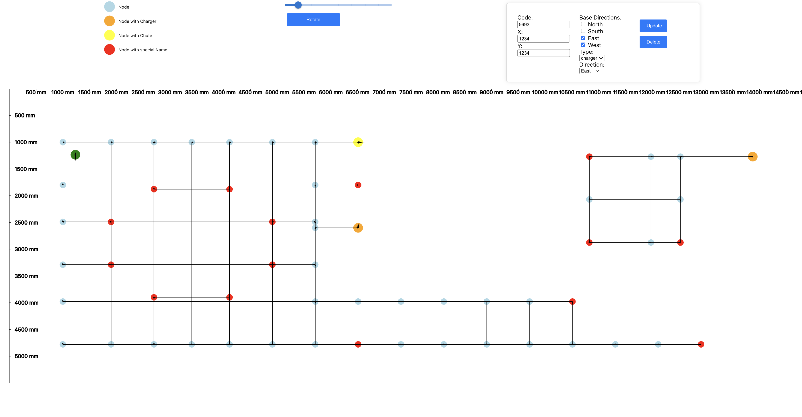

# Mujin Frontend Challenge

## Overview

The task is to create a map editor using React that allows the editing of an AGV (Automated Guided Vehicles) map.

### Tech Stacks

#### Backend

1. **Technology**: Python, Flask
2. **Database**: In-memory data store (for the sake of this prototype)
3. **Endpoints**:
   - GET `/api/map`: Fetch map data
   - PUT `/api/map/nodes/{code}`: Update a node by code
   - POST `/api/map/nodes`: Add a new node
   - DELETE `/api/map/nodes/{code}`: Delete a node by code

#### Frontend

1. **Technology**: React, TypeScript
2. **Features**:
   - Display nodes on an SVG canvas
   - Scale the SVG canvas
   - Add a drag-and-drop feature to the nodes (Make sure to click submit after moving each node)
   - Select a node after dragging, indicating readiness to save changes
   - CRUD functions on nodes
   - Rotate the SVG canvas (in progress)

#### Both

1. **Docker**: Containerize the frontend and backend.
2. **Testing**: Write tests for both frontend and backend components.

## Future Improvement

1. **Rotate**: Finish the rotate functionality.
2. **Icons for node**: Adding icons for different types of nodes
3. **Unit tests**: Finish the testing for higher code coverage.
4. **Vehicle**: Adding a vehicle and perform the actions based on maps.

## Example Map File



## Video Sample

[Sample Video Link](https://youtu.be/PFnf3jm410Q)

You are also welcome to check out other of my videos about Turtlebot 4.

## Requirements

### Main Requirements

- [x] **Docker**: Start with a debian:bullseye Docker image and build on top of it.
- [x] **Frontend**: Written with React and TypeScript. It should have functionalities to edit an AGV map with various node properties.
- [x] **Backend**: Load data from and save data to an HTTP server using a RESTful API (axios). Server can be implemented in Python (Flask).
- [x] **Testing**: Add automated tests for both frontend and backend components.

### Bonus

- [x] **Advanced Features**: Allow zoom, drag & drop nodes, rotate (not working as expected).

### Deliverables

- [x] All source code and documentation committed to a private git repository.
- [x] A Docker image pushed to Docker Hub.
- [x] Detailed documentation on how to run and test the project (follow this instructions below).

## How to Run the Project

### Docker Script (Recommended)

Excute the script (Wait for about 5 seconds and refresh the page after running)

```bash
 sh script.sh
```

### Docker

Open your docker and make sure your docker is running. You need to enter the docker environment to run the images. Also, you need to run those two images seperately.

#### Pull docker images

1. backend

```bash
 docker pull yifu123kkk/agv-map-editor-be
```

2. frontend

```bash
 docker pull yifu123kkk/agv-map-editor-fe
```

#### Run Docker

1. backend

```bash
docker run -p 8000:8000 yifu123kkk/agv-map-editor-be
```

2. frontend

```bash
docker run -p 3000:3000 yifu123kkk/agv-map-editor-fe
```

After running the frontend and backend you need to go to

```bash
http://localhost:3000/
```

### Local Development (Not Recommended)

You need to run the frontend and backend seperately.

#### Clone the repository

```bash
git clone https://github.com/YifuK/mujin_frontend_project.git
```

#### Navigate to project directory

```bash
cd AGV-MAP-EDITOR
```

#### Run backend

```bash
cd backend
python3 -m venv venv
source venv/bin/activate
python3 run.py
```

#### Run frontend (In another terminal)

```bash
cd frontend
npm start
```

## How to Run Tests

### Frontend Tests

Navigate to the frontend directory and run:

```bash
npm test
```

### Backend Tests

For Python:

```bash
python -m unittest test_api.py
```

## Contributing

For any suggestions or bug reports, please open an issue or contact me at [yl896@cornell.edu](yl896@cornell.edu)

## Author

Yifu Liu

